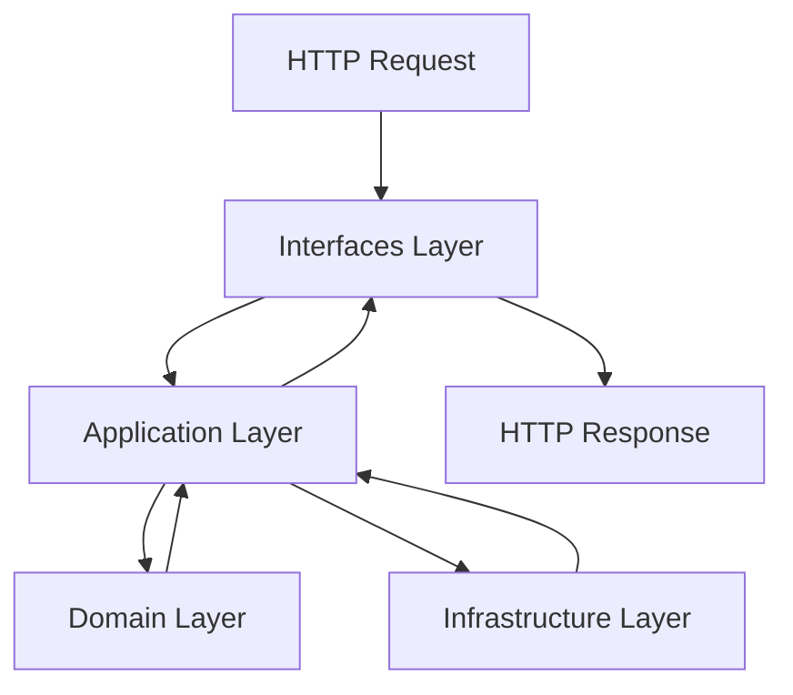
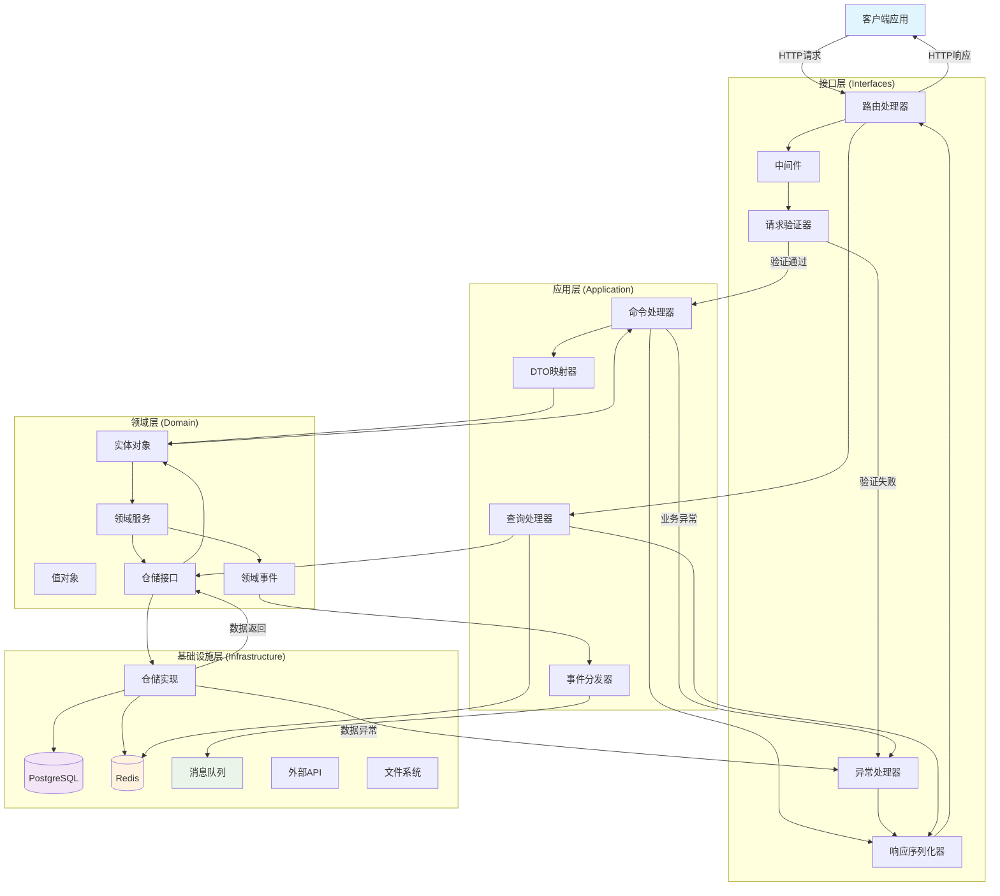
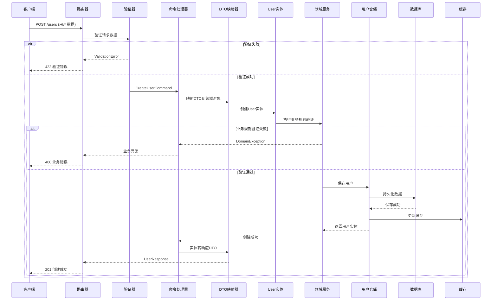
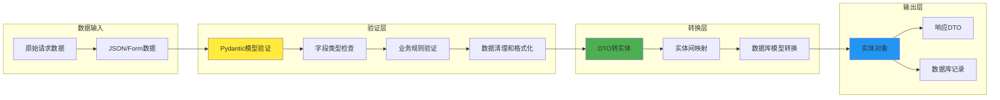
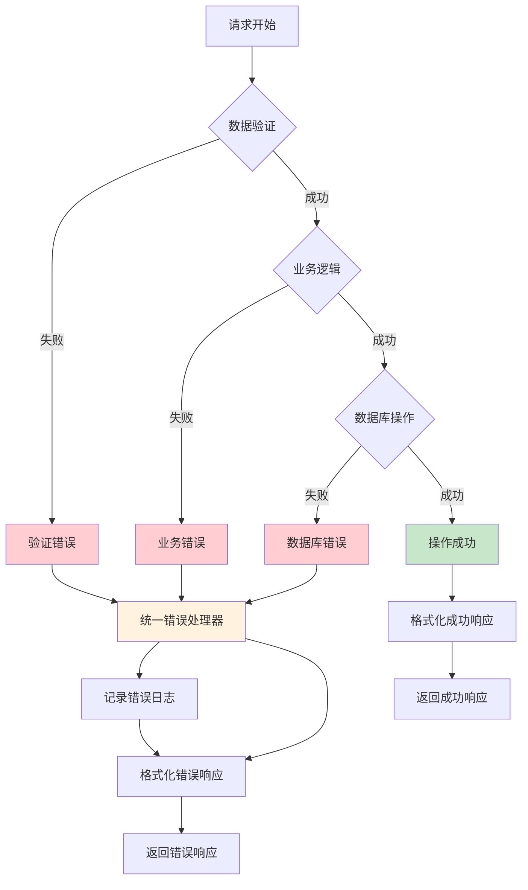

# 架构设计文档

## 概述

Cryptic Pets Backend 采用领域驱动设计（Domain-Driven Design, DDD）架构模式，将应用程序分为四个清晰的层次，确保代码的可维护性、可测试性和可扩展性。

## 架构原则

### 1. 分层架构
- **接口层（Interfaces）**: 处理外部交互
- **应用层（Application）**: 协调业务逻辑
- **领域层（Domain）**: 核心业务逻辑
- **基础设施层（Infrastructure）**: 技术实现细节

### 2. 依赖倒置
- 高层模块不依赖低层模块
- 抽象不依赖具体实现
- 具体实现依赖抽象

### 3. 单一职责
- 每个类和模块都有明确的职责
- 代码职责清晰，易于维护

## 分层详解

### 接口层（Interfaces）
> 路径: `interfaces/`

负责处理外部请求和响应，包括HTTP API、命令行接口等。

```
interfaces/
├── http/                    # HTTP接口
│   ├── __init__.py
│   ├── base_response.py     # 通用响应模型
│   ├── exceptions_handler.py # 异常处理器
│   └── v1/                  # API版本1
│       ├── __init__.py
│       └── routers/         # 路由模块
│           ├── __init__.py
│           └── user.py      # 用户相关路由
```

**职责**:
- HTTP请求路由和处理
- 请求参数验证
- 响应格式统一
- 异常处理和错误返回
- API版本管理

**关键组件**:

#### BaseResponse
```python
class ApiResponse(BaseModel):
    success: bool = True
    code: int = 200
    message: str = "操作成功"
    data: T | None = None
    meta: T | None = None
```

#### 异常处理
```python
class BizException(Exception):
    def __init__(self, code: int = 400, message: str = "业务异常"):
        self.code = code
        self.message = message
```

### 应用层（Application）
> 路径: `application/`

协调领域对象完成业务用例，不包含业务逻辑。

```
application/
├── __init__.py
└── users/                   # 用户应用服务
    ├── __init__.py
    ├── commands.py          # 命令对象
    └── handlers.py          # 命令处理器
```

**职责**:
- 用例协调
- 事务管理
- 权限验证
- 调用领域服务
- 数据传输对象（DTO）

### 领域层（Domain）
> 路径: `domain/`

包含业务核心逻辑，是整个应用的核心。

```
domain/
├── __init__.py
├── base_entity.py           # 基础实体类
└── users/                   # 用户领域
    ├── __init__.py
    ├── entities.py          # 实体对象
    ├── exceptions.py        # 领域异常
    ├── repository.py        # 仓储接口
    └── value_objects.py     # 值对象
```

**职责**:
- 业务实体定义
- 业务规则实现
- 领域服务
- 领域事件
- 仓储接口定义

**关键组件**:

#### 基础实体 (BaseEntity)
```python
class BaseEntity(BaseModel):
    id: str | None = None
    created_at: datetime = Field(default_factory=datetime.now)
    updated_at: datetime = Field(default_factory=datetime.now)
    is_deleted: bool = Field(default=False)
    
    def mark_as_deleted(self) -> None:
        self.is_deleted = True
        self._update_timestamp()
```

#### 用户实体 (User)
```python
class User(BaseEntity):
    username: str
    email: str
    full_name: str | None = None
    hashed_password: str
    user_type: UserTypeEnum = UserTypeEnum.USER
    is_active: bool = True
```

#### 值对象 (Value Objects)
```python
class UserTypeEnum(str, Enum):
    ADMIN = "admin"
    USER = "user"
    GUEST = "guest"
```

### 基础设施层（Infrastructure）
> 路径: `infrastructure/`

提供技术实现，包括数据库访问、外部服务调用等。

```
infrastructure/
├── __init__.py
├── config.py                # 配置管理
├── logging/                 # 日志配置
│   └── config.py
└── persistence/             # 数据持久化
    └── postgres/            # PostgreSQL实现
        ├── __init__.py
        ├── init_db.py       # 数据库初始化
        └── models/          # 数据库模型
            ├── base.py      # 基础模型
            └── user.py      # 用户模型
```

**职责**:
- 数据库访问
- 外部API调用
- 文件系统操作
- 缓存实现
- 消息队列
- 配置管理

**关键组件**:

#### 配置管理 (Settings)
```python
class Settings(BaseSettings):
    PROJECT_NAME: str
    ENVIRONMENT: Literal["local", "staging", "production"] = "local"
    POSTGRES_SERVER: str
    POSTGRES_USER: str
    SECRET_KEY: str
    # ... 其他配置项
```

#### 数据库模型 (UserModel)
```python
class UserModel(BaseModel, table=True):
    __tablename__ = "users"
    
    username: str = Field(index=True, unique=True)
    email: str = Field(index=True, unique=True)
    hashed_password: str
    user_type: UserTypeEnum = UserTypeEnum.USER
    is_active: bool = True
```

## 数据流向

### 1. 整体架构数据流



### 2. 详细数据流转图



### 3. 用户创建流程示例



### 4. 数据验证和转换流程



### 5. 错误处理数据流



### 请求处理流程

1. **HTTP请求** → 接口层路由处理
2. **中间件处理** → CORS、认证、限流等
3. **参数验证** → Pydantic模型验证
4. **应用服务** → 协调业务逻辑执行
5. **领域逻辑** → 执行核心业务规则
6. **数据持久化** → 基础设施层数据操作
7. **事件处理** → 领域事件分发和处理
8. **响应构建** → 统一格式响应
9. **异常处理** → 统一错误处理和日志记录

## 核心模式

### 1. 仓储模式（Repository Pattern）
- 抽象数据访问逻辑
- 领域层定义接口，基础设施层实现
- 便于单元测试和数据源切换

### 2. 命令查询职责分离（CQRS）
- 命令（Command）：修改数据的操作
- 查询（Query）：读取数据的操作
- 分离读写操作的职责

### 3. 领域事件（Domain Events）
- 捕获领域中发生的重要事件
- 实现松耦合的业务逻辑
- 支持事件驱动架构

### 4. 依赖注入（Dependency Injection）
- 通过FastAPI的依赖注入系统
- 管理对象生命周期
- 便于测试和模块解耦

## 技术实现细节

### 1. FastAPI 集成
```python
# main.py
app = FastAPI(
    title=settings.PROJECT_NAME,
    openapi_url=f"{settings.API_V1_STR}/openapi.json",
    lifespan=lifespan
)
app.include_router(api_router, prefix=settings.API_V1_STR)
```

### 2. 数据库集成
```python
# SQLModel + PostgreSQL
engine = create_engine(settings.SQLALCHEMY_DATABASE_URI)

def init_db():
    SQLModel.metadata.create_all(engine)
```

### 3. 异常处理
```python
app.add_exception_handler(BizException, biz_exception_handler)
app.add_exception_handler(Exception, global_exception_handler)
```

### 4. 日志配置
```python
# Loguru 结构化日志
logger.add(
    sys.stdout,
    level=settings.LOG_LEVEL,
    serialize=True  # JSON格式
)
```

## 扩展指南

### 添加新的领域模块

1. **创建领域目录**
```bash
mkdir domain/your_module
```

2. **定义实体和值对象**
```python
# domain/your_module/entities.py
class YourEntity(BaseEntity):
    # 定义属性和方法
    pass
```

3. **创建仓储接口**
```python
# domain/your_module/repository.py
from abc import ABC, abstractmethod

class YourRepository(ABC):
    @abstractmethod
    async def save(self, entity: YourEntity) -> YourEntity:
        pass
```

4. **实现基础设施**
```python
# infrastructure/persistence/postgres/models/your_model.py
class YourModel(BaseModel, table=True):
    __tablename__ = "your_table"
    # 定义数据库字段
```

5. **添加应用服务**
```python
# application/your_module/handlers.py
class YourHandler:
    async def handle(self, command: YourCommand) -> YourResponse:
        # 实现业务逻辑
        pass
```

6. **创建HTTP接口**
```python
# interfaces/http/v1/routers/your_router.py
router = APIRouter()

@router.post("/your-endpoint")
async def your_endpoint():
    # 处理HTTP请求
    pass
```

## 最佳实践

### 1. 实体设计
- 实体应该富含行为，而不仅仅是数据容器
- 使用值对象来表示概念完整的小对象
- 保持实体的一致性和不变性

### 2. 服务设计
- 领域服务包含不属于任何实体的业务逻辑
- 应用服务协调多个领域对象
- 避免贫血领域模型

### 3. 错误处理
- 使用特定的领域异常
- 在接口层统一处理异常
- 提供有意义的错误信息

### 4. 测试策略
- 单元测试专注于领域逻辑
- 集成测试验证层间交互
- 端到端测试验证完整流程

## 性能考虑

### 1. 数据库优化
- 合理使用索引
- 避免N+1查询问题
- 使用连接池

### 2. 缓存策略
- Redis缓存热点数据
- 应用级缓存
- HTTP缓存头

### 3. 异步处理
- 使用FastAPI的异步特性
- 异步数据库操作
- 后台任务处理

## 安全考虑

### 1. 认证授权
- JWT令牌认证
- 基于角色的访问控制
- 密码安全策略

### 2. 数据保护
- 输入验证和清理
- SQL注入防护
- XSS防护

### 3. 审计日志
- 记录重要操作
- 追踪数据变更
- 监控异常访问
